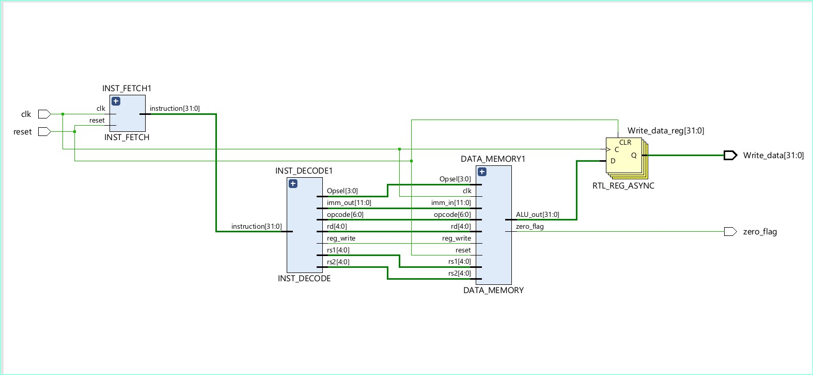

# RISC-V Multi-Stage Processor

## Overview
This project implements a multi-stage RISC-V processor that supports arithmetic, logical, shift, and comparison operations for both register and immediate instruction types. Load and Store operations are not yet implemented but will be added in future updates.

## Features
- Implements a multi-stage pipeline
- Supports arithmetic, logical, shift, and comparison operations
- Instruction memory is read from `INST_MEM.mem`
- Program counter increments by 4 per cycle
- Register-based execution with an ALU for computations

<h1 align="center">Processor Design</h1>
<p align="center">
  
</p>

<h1 align="center">RTL Schematic</h1>
<p align="center">
  
</p>

<h1 align="center">Instruction Set</h1>
<p align="center">
  
</p>

## Directory Structure
```
|-- Design Sources
|   |-- PROCESSOR.v (Top-level module)
|     |-- INST_FETCH.v (Instruction Fetch Stage)
|     |-- INSTRUCTION_MEM.v (Instruction Memory - Reads from INST_MEM.mem)
|     |-- PC.v (Program Counter)
|   |-- INST_DECODE.v (Instruction Decode Stage)
|     |-- CONTROL_UNIT.v (Control Unit - Decodes Opcodes and Functions)
|   |-- DATA_MEMORY.v (Execution and Write-Back Stage)
|     |-- REGISTER_MEM.v (Register File - Holds Register Data)
|     |-- IMM_GEN.v (Immediate Generator)
|     |-- ALU.v (Arithmetic Logic Unit - Executes Operations)
|-- INST_MEM.mem (Instruction memory file, preloaded with instructions, which is used in INSTRUCTION_MEM.v)
```

## Modules Description
### PROCESSOR.v
- The top-level module integrating all the pipeline stages.
- Handles reset and clock signals.
- Stores ALU results and zero flag output.

### INST_FETCH.v
- Fetches a 32-bit instruction from `INSTRUCTION_MEM.v`.
- Increments the Program Counter (PC) by 4.

### INSTRUCTION_MEM.v
- Stores instructions in memory.
- Reads from `INST_MEM.mem` file at initialization.
- Fetches instructions based on the program counter.

### PC.v
- Implements the program counter.
- Initializes to zero on reset and increments by 4 otherwise.

### INST_DECODE.v
- Decodes the fetched instruction.
- Extracts opcode, register addresses, function codes, and immediate values.

### CONTROL_UNIT.v
- Decodes opcode and function codes.
- Determines operation selection (`Opsel`) for ALU and also write enable.

### DATA_MEMORY.v
- Handles execution and write-back stages.
- Fetches operands from register memory.
- Sends operands to the ALU for execution.

### REGISTER_MEM.v
- Implements a 32-register file.
- Stores and retrieves register values.
- Supports immediate values for certain instruction types.

### IMM_GEN.v
- Generates 32-bit signed immediate values from 12-bit instruction fields.

### ALU.v
- Performs arithmetic and logical operations.
- Supports shift, comparison, and bitwise operations.
- Generates a zero flag output for conditional operations.

## How to Run
1. Clone the repository:
   ```sh
   git clone https://github.com/HanumanSagarBathula7392/RISC_V_Processor_Using_Verilog.git
   cd Processor_Module
   ```
2. Ensure a Verilog simulator like ModelSim or Xilinx Vivado is installed.
3. Load and compile all Verilog files in your simulator.
4. Provide `INST_MEM.mem` as the instruction memory file. (When using ModelSim, simply specify the directory location of INST_MEM.mem.)
5. Run the simulation and observe outputs such as `Write_data` and `zero_flag`.

## Future Enhancements
- Implement Load and Store operations.
- Add forwarding and hazard detection mechanisms.
- Expand support for additional RISC-V instruction formats.

## References
For more details, refer to the [**RISC-V Instruction Manual**](https://github.com/HanumanSagarBathula7392/RISC_V_Processor_Using_Verilog/blob/master/Images/RISC_V_MANUAL.pdf) provided in the project.

## License
This project is open-source and available under the [MIT License](https://github.com/HanumanSagarBathula7392/HanumanSagarBathula7392/blob/main/LICENSE).

**Developed by:** Hanuman Sagar Bathula. <br>
**Tech Used:** Verilog, Xilinx Vivado/ModelSim, FPGA, RISC-V ISA, Pipeline, Datapath, Instruction Memory, Data Memory.


